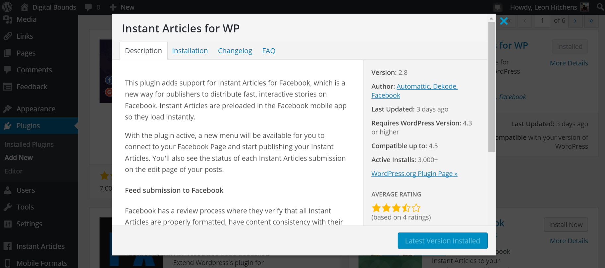
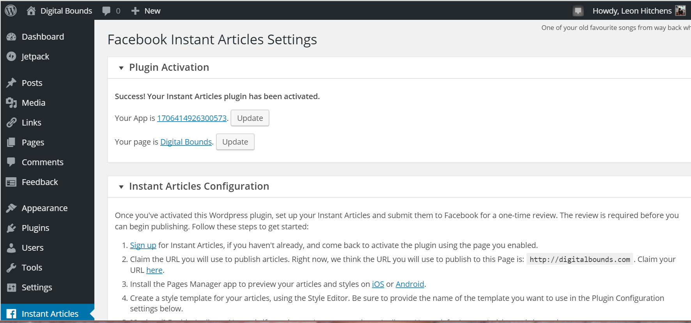
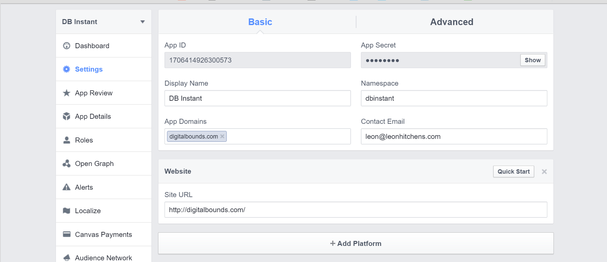
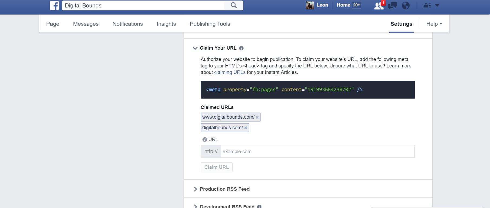
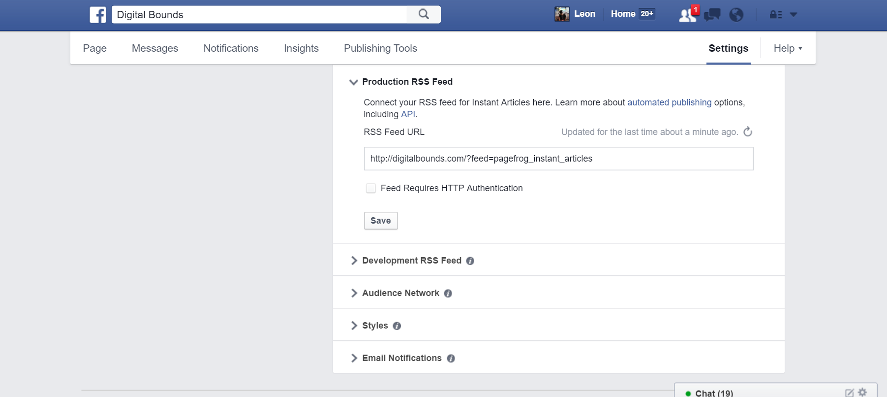
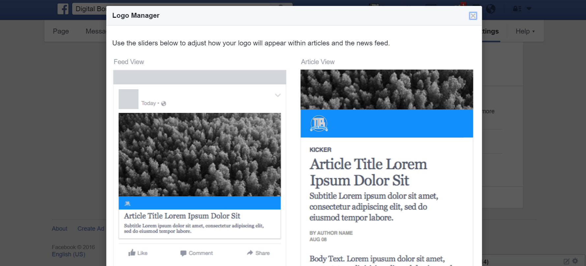
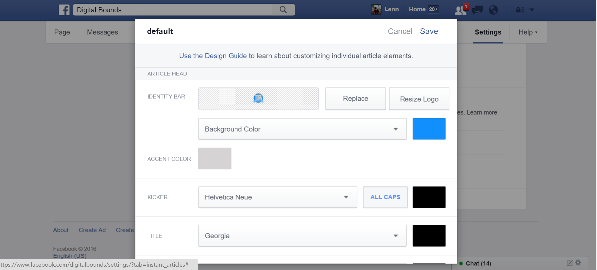
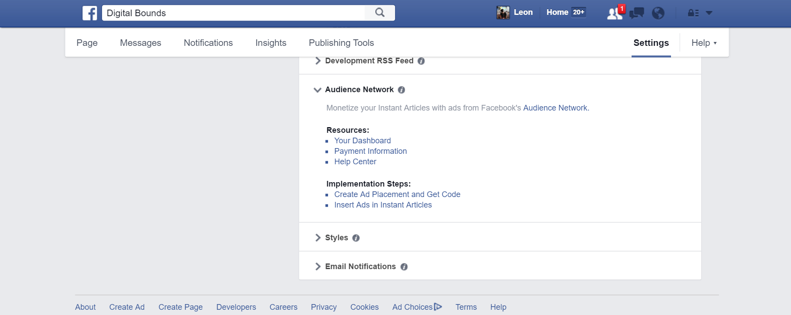
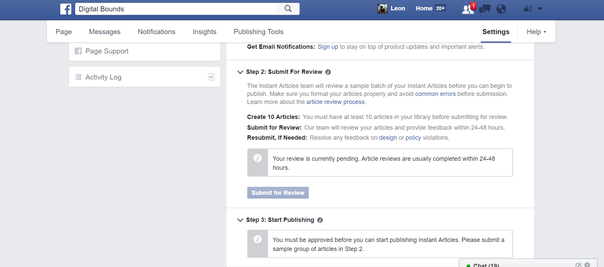

Facebook Instant Articles are stripped down version of your blog hosted on Facebook’s servers. The pages load *instantly* and have minimal branding from your site. While many publishers argue the Instant Articles are bad for publishers, they have higher engagement and read time than a standard web page - surprise when something loads quickly users are more likely to use it. Even though your website branding may is minimal, you're still able to generate ad revenue from the articles through Facebook’s Audience Network or Google Adsense. 

The Instant Articles aren’t limited to large publishers like Vice, BuzzFeed, or CNN. [Facebook Instant Articles open to any publisher](http://digitalbounds.com/2016/04/12/facebook-instant-articles-are-now-open-to-all-publishers/) large or small, making it necessary and somewhat easy to enable Instant Articles on your site. I spent a few hours researching Wordpress plugins, searching for how to set up the Facebook app, and finally how to necessary my older articles into Facebook’s newish platform. Now my struggle is going to help you through the process of setting up Instant Articles through WordPress. 

# WordPress Plugin

First, you’re going to want to grab a WordPress plugin for Facebook’s Instant articles to make everything easier. A lot of publishers are using the PageFrog plugin, but it hasn’t been updated with new instructions for the updated process. While Vox Media uses a version of the plugin, I’ve found the Instant Articles for WP plugin to be extremely useful, and helpful because Automattic, Facebook, and another developer are all working on the plugin. 

Once installed the bottom left corner will show the Instant Article Menu where you can setup the plugin. Also, give you a step by step that you can also follow along with. 

# Facebook Developer App

Once the plugin is installed, it’s going to want a Facebook App to not only verify your website's address but to help it publish articles to the Instant Article platform. You have to add a new app, name it whatever you’d like. I called mine DB Instant because I have other apps for other integrations I work on. Then press the "Add Platform" button where you’ll add a “website.” The web address will be yourdomain.com, and allow Facebook to verify you own the website and that’s where you're going to publish from.

# Claim your URL

Claiming your website's URL is the most important step, and you cannot move forward without this critical step. The tag for the website doesn’t have to be added because you're using a Facebook developer app to authorize your site. Simply add your address and press "*Claim URL.*."

# Production RSS Feed

Then the Production RSS Feed is going to be the RSS feed from your website. You’ll drop the link in there so Facebook can add older articles into the Facebook platform, and have articles that you can submit to Facebook for Review. 

Style the Instant Articles

Even though Facebook controls the main stylings of the articles, you're able to add your logo in the little header section. There are a lot of options for font styles, font colors, and accent colors. You’ll have to play around with the different styles and try to find something that fits your website's style and branding. 

# Audience Network

If you use blogging or writing as a primary source of income, you’ll want to enable ads either through Facebook’s own Audience Network or Google Adsense. If you mainly use Adsense and feel more comfortable with the platform, you can enable to ads through the Wordpress plugin. I opt for Facebook’s Audience Network because I’m hoping their ads will not only be higher quality but offer higher CPMS than Google’s network might. 

The ads are still banner ads and don’t include pop-up, overlay, or other annoying ads that you’ll find on the web. 

# Submit for Review

Submitting for review is to ensure your articles are a good fit for Facebook’s network and don’t to break what Facebook is doing. The articles are formatted to Instant Article style from your RSS feed, and you’ll need over 50 articles in the platform before Facebook lets you submit them for review. 

The process takes anywhere from 24 to 48 hours, but sometimes quicker when Facebook is in full force. My review took close to the 48-hour mark, but I have over 600 articles that I reformatted for Instant Articles. 

# Enjoy Instant Articles

The setup process should take an hour, which isn’t long when you're setting something up on Facebook. The process is an outline on their documentation, but can sometimes be vague and not hold your hand when you're trying to set something up that is new and somewhat confusing. There are a lot of moving parts to the setup, and I took well over 3 hours trying to set up and figure out any problems I encountered.

I’ve been excited to use Instant Articles since they first announced the feature.I would read a lot of news on Facebook, and sites did take a long time to load or had shitty ads. Facebook’s new platform makes articles load *instantly’ *, and every publisher is confirmed to a set of rules for ads. That means no ugly pop-ups or overlays that distract from the writing. It’s simply pictures, words, and an ad or two. Nothing more or less. 

The Ninjality team works with publishers who want their branding to an extent far beyond their websites or blogs, and we offer integrations to Facebook’s Instant Articles if you’re feeling like this process is too overwhelming. Head over to the [contact page](https://ninjality.com/contact) to tell us if you need Facebook Instant Article help and if you’d like the styling to match a new WordPress custom theme you also want to be built ;)