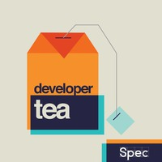
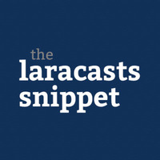
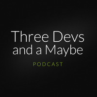
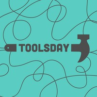
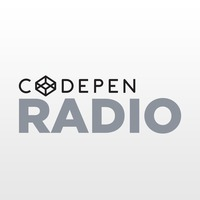
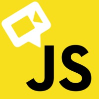
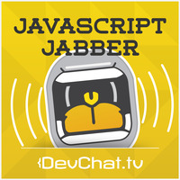
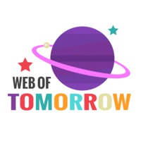

If you're a developer, you may be wanting to improve your skills but lack the time to devote in reading books, watching videos, or reading articles (glad you're reading this one though!). So, how do we go about our normal days while still leveling up? Podcasts. More specifically, audio podcasts which are much like radio shows but on specific topics. The great part about them is being able to listen while doing other tasks. As you can guess, we will list ones that discuss developer-related topics as curated by our team.

## ShopTalk

[ShopTalk](http://shoptalkshow.com/) is "a web design and development podcast with Chris Coyier and Dave Rupert."

Both hosts are well-known in the web design industry, and you've probably came across Chris' website, [CSS-Tricks](https://css-tricks.com/), multiple times. What's great about ShopTalk is not only the hosts' humor (hats off to Dave's sound effects), but the catering to both beginner and advanced audiences. They typically answer various coding questions that will surely save you some Googling when you encounter the same problem, but also do interviews from time to time.

## Developer Tea

[Developer Tea](http://spec.fm/podcasts/developer-tea) is "a podcast for developers designed to fit inside your tea break." 

Host Jonathan Cutrell shares his wisdom on various topics in programming and business. What makes this podcast stand out is how some topics seem unrelated and yet are very important to master, such as proper communication skills, imposter syndrome, etc. Also, the short length of each episode makes it a good listen during quick commutes or tasks.

## The Laracasts Snippet

[The Laracasts Snippet](https://laracasts.simplecast.fm/)," each episode, offers a single thought on some aspect of web development. Nothing more, nothing less. Hosted by Jeffrey Way."

This is complementary podcast to Jeffrey's screencasts site, [Laracasts](https://laracasts.com/). Similar to Developer Tea, Jeffrey offers various thoughts based on his experience in development. Each episode is an average of five minutes but packs a lot of information.

## Three Devs and a Maybe

[Three Devs and a Maybe](http://threedevsandamaybe.com/) is a "weekly discussion podcast on all things web development. Topics range from daily developer life, PHP, frameworks, testing, good software design and our experiences using many other programming languages."

If you imagine yourself and a couple of friends getting together to catch each other up on life and code things, and enjoy the thought of that, then this is the podcast for you. Hosted by the friendly Michael Budd, Fraser Hart, Lewis Cains, and Edd Mann.

## Toolsday

[Toolsday](http://toolsday.io/) "is a 20-ish-minute podcast about the latest in tech tools, tips, and tricks on Tuesdays at 2! (Our alliteration game is so strong). The podcast is brought to you by Chris Dhanaraj and Una Kravets."

There are a [ton of tools](https://ninjality.com/blog/slimming-down-your-toolset) in the development world, and this podcast helps you learn about each one. Not only do the hosts discuss important topics such as accessibility and unit testing, but they also let you know which tools can help you accomplish such tasks. Oh, and you get to listen to Una sing a new theme song in the beginning of each episode.

## CodePen Radio

[CodePen Radio](https://blog.codepen.io/radio/) is "a podcast all about what it's like running a small web software business. The good, the bad, and the ugly."

Another podcast with Chris Coyier, along with other smart founders Alex Vasquez and Tim Sabat. They cover what it's like to run [CodePen](http://codepen.io/) and you are sure to learn a lot if you are interested in doing your own startup on the internet. It's also a good reference on things like downtime, deployments, hiring, and funding.

## JavaScript Air

[JavaScript Air](https://javascriptair.com/) is "the live broadcast podcast all about JavaScript."

If you're wanting gains in your JavaScript skills, then this podcast is a good listen. You'll hear about various frameworks such as React and Angular, and build tools such as webpack. Hosted by Kent Dodds, who is an instructor on [https://egghead.io/](egghead.io), along with other smart panelists.

## JavaScript Jabber

[JavaScript Jabber](https://devchat.tv/js-jabber) "is a weekly discussion about JavaScript, front-end development, community, careers, and frameworks."

If that's not enough JavaScript for you, take a look at JSJ which is hosted by Charles Wood. A guest will come on each episode to discuss a specific framework, tool, or related topic in front-end.

## Web of Tomorrow

)

[Web of Tomorrow](http://www.weboftomorrowpodcast.com/) is "a podcast about JavaScript, web development, web design, and technology. We are Riley Carrasquillo (the noob) and Adam Harris (the not noob), and we love web technology and we love talking about it."

Rounding off the list is a general podcast about web development. Each episode is about 15 minutes on advanced web topics that are explained in simplified ways.

## Share Yours!

What did you think of our list? Do you have your own suggestions? Leave a comment below or on our [Twitter](https://twitter.com/ninjalitydesign) and [Facebook](https://www.facebook.com/ninjalitydesign).