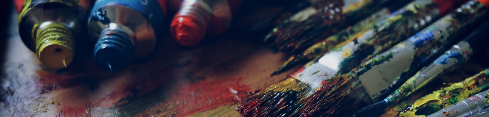

Ninjality has gone through multiple redesigns. With each iteration, we further realize what we should be focusing on. Our previous one in 2015 was quite significant, because we rebranded with a completely new logo, design, and marketing strategy. Today, we're releasing another redesign to kick off the year of 2017, and for many good reasons.

## Simplify our focus

We pride ourselves in being unique, so much so that our home page used to say that we were "creating cutting-edge social experiences for the modern web." While that sounds cool, even we didn't have a full idea of what that meant. Thus, we decided to simplify our focus to make it clear on what we actually did. Our new tagline is "building websites that work" and while that isn't unique, it's straight to the point.

This simplified language style is used throughout the new design, where we try to avoid jargon and explain things as they are. On the new home page, our work and services are showcased and explained clearly. To summarize, we build websites and web apps that work well on multiple devices, and we go to further lengths to help brand your company on social media.

## Grow our blog into a useful resource

While initially a place to post occasional announcements, we recently started to turn the blog into a resource where you could read our expertise (or our process in gaining it) on various topics revolving around design, coding, marketing, and business. In 2016, we've written 27 articles which have received high traction.

Realizing that this was something we enjoyed doing, it only made sense to have a design and platform which could facilitate that. Our previous CMS (content management system), Anchor, was lacking features that we now needed. Thus, after trying out different platforms, we happily settled on using [October CMS](http://octobercms.com/). This is a CMS that is built on top of Laravel, which is a web framework that we already used on previous projects. We felt right at home with October, and were able to add new features to the blog such as the series pages. For example, there is now a page for the [Let's Learn React Together series](/blog/series/lets-learn-react-together) which has a description and lists all of the tutorials in chronological order. Also, as you may notice on this article, we are now going to be adding large cover photos.

Expect to see a more in-depth review and tutorial of October soon.

## Build relationships with the community

On top of our work as a web design agency, we also want to be a part of the community. Here are some ways we wish to do that:

- Write tutorials and share advice on the blog, and allow discussions through Facebook Comments.
- Contribute to the [open source community](/opensource).
- Share and talk with everyone on social media.

## Showcase and learn new skills

And finally, we wanted to show off our possibilities. As mentioned before, we migrated over from Anchor to October which is a completely new platform for us. On the front-end side of things, we kept to just building out the UI without any large frameworks. A couple of tools and libraries worth mentioning:

- [Turbolinks](https://github.com/turbolinks/turbolinks) which helps speed up navigation. It fetches and renders pages via Ajax, so that our site feels like a single-page app.
- [cssnext](http://cssnext.io/) which is PostCSS plugin and an alternative to Sass or Less. It lets us use future CSS syntax.
- [socialshares](https://socialshar.es/) which is our own open source library for share buttons. We've recently released version 2 so please check it out for yourself.

## Closing thoughts

We hope that you enjoy the new design as much as we do, and that it makes things simpler in finding out what we do, reading our content, and interacting with us. If you have questions or suggestions, we'd love to hear them. Be sure to follow our [Twitter](https://twitter.com/NinjalityDesign), [Facebook](https://www.facebook.com/NinjalityDesign), and [LinkedIn](https://www.linkedin.com/company/ninjality) for updates when new articles are published, or [contact us](/contact) if you want to work on an idea together.